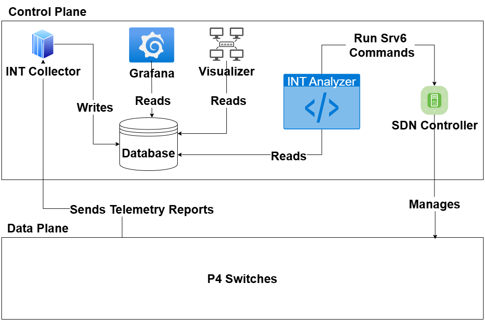
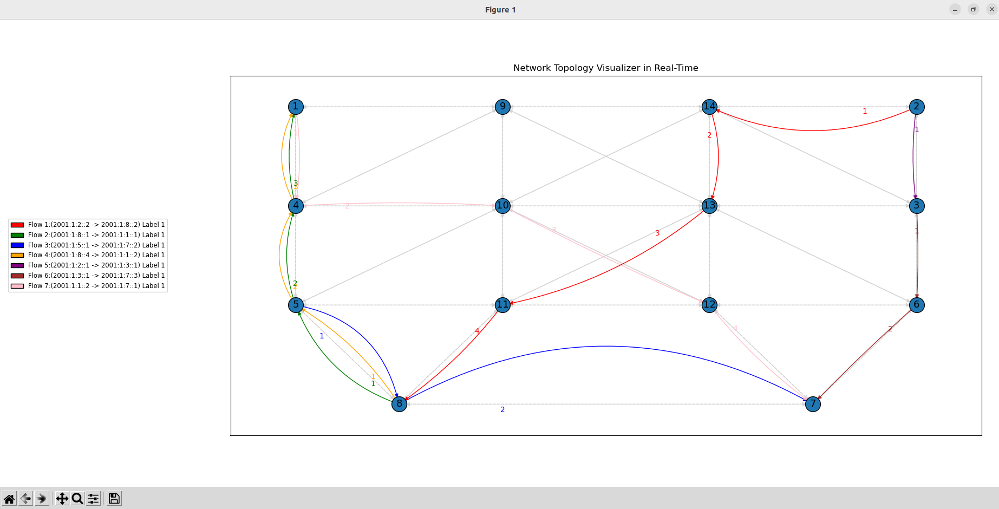

# p4-srv6-INT
This work was performed in the scope of the project MH-SDVanet: Multihomed Software Defined Vehicular Networks (reference PTDC/EEI-COM/5284/2020).<br/>


Fork of the project [netgroup/p4-srv6](https://github.com/netgroup/p4-srv6), implements SRv6 in Mininet environment where the switches use P4.

This repository aims to expand that project by adding to it: <br/>
 * `In-band Network Telemetry (INT)`, selected data flows, defined by ONOS, will generate Telemetry. <br/>
 * `Grafana Dashboard`, using the collected INT in the DB, represent it via real-time graphs. <br/>
 * `Visualizer`, a Python script that reads the INT data and represents the paths currently taken by the data flows in the topology. <br/>
  * `INT Collector`, a Python script that sniffs the INT Report packets and stores their indormation in the Database. <br/>
 * `INT Analyzer`, a Python script that reads the INT data and tries to detected overloaded switches and cause data flow detours from said switches to less congestioned ones, by only using the SRv6 operations from ONOS, and disable said detours when no longer needed. <br/>
 * `Routing Methods`, the original project used static routing, we inteed to expand ONOS so it can calculate and push new routing rules to the switches on demand, specifically using the algorithms: K shortest path and ECMP. 


# Credits<br/>

The Topology Visualizer and the Grafana Dashboards were developed by [Tiago Mustra](https://github.com/TiagoMustra)

For the base INT implementation in P4, the collecting, and storing of data, we used the code from the project [ruimmpires/P4INT_Mininet](https://github.com/ruimmpires/P4INT_Mininet).

The KShort code for path calculations done by ONOS was based on project: [bmsousa/ONOS-Framework](https://github.com/bmsousa/ONOS-Framework)

The ECMP code for path calculations done by ONOS was based on project: [ruicao93/simple-ecmp](https://github.com/ruicao93/simple-ecmp/tree/master)


# Repository structure
This repository is structured as follows: <br/>
 * `app/` ONOS app Java implementation <br/>
 * `config/` configuration files <br/>
 * `INT/` Contains all the programs that use the INT: `Grafana`, `Analyzer`, `Visualizer`, and the Python scripts used to `send/receive` the packets that generate telemetry <br/>
 * `mininet/` Mininet scripts to emulate a topology of `stratum_bmv2` devices <br/>
 * `images/` Contains the images used on this ReadMe file. <br/>
 * `p4src/` P4 implementation <br/>
  * `Commands/` Contains files with CLI commands for testing <br/>
 * `test/` some test scripts be runned directly on the hosts of the topology <br/>
 * `utils/` utilities include dockerfile and wireshark plugin <br/>
 * `tmp/` temporary directory that contains the logs from `ONOS` and the `P4 Switches`<br/>

# Architecture



This repository is structured as follows: <br/>
 * `Docker` Runs 2 conrtainers, one for mininet with the topology, other for ONOS controller and it's CLI. The mininet switches have a direct connection to ONOS. <br/>
 * `ONOS` is the SDN controller used, contains a CLI to access it's opeartions, for details see [ONOS](#ONOS) section. <br/>
 * `Mininet`, programm used to simulate the network topology, all switches use the same P4 code, and the used virtual interfaces are native to the System that hosts the Docker engine, for details see [Mininet](#Mininet) section. <br/>
 * `InfluxDB`, is the used database to store the collected INT data, for details see [Database](#Database) section. <br/>
 * `Grafana`, is tools used to visualize, in real-time, the collected telemetry in the form of graphs, for details see [Grafana](#Grafana) section. <br/>
 * `Visualizer`, python script that reads the Database and processes the data to represent, in real-time, which paths in our topology each data flow is taking, for details see [Visualizer](#Visualizer) section. <br/>
 * `INT Analyzer`, python script that reads the Database to detected for overloaded switches and cause path detours by using ONOS's CLI, for details see [INT Analyzer](#INT-Analyzer) section. <br/>
  * `INT Collector`, python script that sniffs the packets from the topology switches' interfaces that are facing the INT collector, for details see [INT Collector](#INT-Collector) section.<br/>


# Setup

For the developemnt of this project we used Ubuntu LTS 20.04/22.04, so the presented commands are meant to it.
Any Linux Distro capable of installing the needed programs should work fine.

### Install Docker Engine
For Ubuntu the process is different from other distros, so it's recommened to follow the official instruction [here](https://docs.docker.com/engine/install/ubuntu/).

### Install Dependencies
In any location run:

```bash
sudo apt-get install sshpass     #install sshpass to be able to use the make commands
sudo apt install python3-pip   
sudo pip3 install scapy          #send/process packets
sudo pip3 install mininet        #install mininet at host (makes clean ups easier)
sudo pip3 install numpy          #to do MCDA
sudo pip3 install openpyxl       #to export raw CSV results to excel
sudo pip3 install paramiko       #for the INT Analyzer
sudo pip install networkx        #to visualize the network flows in the topology in real-time
sudo pip install matplotlib      #to visualize the network flows in the topology in real-time
```
In the root of the project run:
```bash
#Install our container's dependencies
sudo make deps                   
```

### Install InfluxDB
We used InfluxDB v.1.8. The installation process can be seen [here](https://docs.influxdata.com/influxdb/v1/introduction/install/).

```bash
#A client for Python to interact with InfluxDB.
sudo pip3 install influxdb    

#enable influxdb to start on boot
sudo systemctl enable influxdb  
```

Create the int database
```bash
#connect to InfluxDB
influx

#create the DB for the INT telemetry
influx> create database int

#(optional) Check if the DB was created 
influx> use int
```


### Install Grafana
The installation process can be seen [here](https://grafana.com/docs/grafana/latest/setup-grafana/installation/debian/#install-from-apt-repository), we used "Install from APT repository".


After installing, run:

```bash
#start grafana now
sudo systemctl start grafana-server 

#enable grafana-server to start on boot
sudo systemctl enable grafana-server
```

The Web Interface can be accessed at http://localhost:3000/<br/>
username: admin<br/>
password: admin


#### Connect to InfluxDB

Go to Connections > Data sources, select InfluxDB and use the default url: http://localhost:8086<br/>
Select the database int<br/>
usernmae: admin<br/>
password: admin<br/>
Test and if all is ok, you will see the message of success

#### Import Dashboard
After configuring the data source, copy it's uID (unique ID), that can be seen at the URL after "/datasources/edit/"
and paste it at the file "INT/grafana/INT statistics.json" at all variables "uid", replace the old value.

Go to Home > Dashboards > Import dashboard and upload the Grafana Dashboard .json "INT/grafana/INT statistics.json"

### Wireshark (Optional)
To help dissecting INT reports, install wirehsark plugin located at "util/wireshark/P4INT_report_IPV6.lua"<br/>
into <br/>"/usr/lib/x86_64-linux-gnu/wireshark/plugins/"

It's limited to a fixed number of hops, but is easy to modify to a different number and to new report's fields.

Some data is displeyed incorrectly, trust the one printed by the INT collector.


# Implementation

## Database
The measurements in the DB are the following:

<div style="display: flex; justify-content: space-between;">

  <table>
    <tr>
      <th colspan="2">Flow Stats (entry per packet)</th>
    </tr>
    <tr>
      <td><strong>Measurement</strong></td>
      <td><code>values</code></td>
    </tr>
    <tr>
      <td><strong>Tags</strong></td>
      <td><code>src_ip</code><br><code>dst_ip</code><br><code>flow_label</code></td>
    </tr>
    <tr>
      <td><strong>Time</strong></td>
      <td><code>metric_timestamp</code></td>
    </tr>
    <tr>
      <td><strong>Fields</strong></td>
      <td><code>src_port</code><br><code>dst_port</code><br><code>protocol</code><br><code>size</code><br><code>dscp</code><br><code>latency</code><br><code>path</code></td>
    </tr>
  </table>

  <table>
    <tr>
      <th colspan="2">Switch Stats (entry per switch's packet processing)</th>
    </tr>
    <tr>
      <td><strong>Measurement</strong></td>
      <td><code>switch_stats</code></td>
    </tr>
    <tr>
      <td><strong>Tags</strong></td>
      <td><code>switch_id</code><br><code>src_ip</code><br><code>dst_ip</code><br><code>flow_label</code></td>
    </tr>
    <tr>
      <td><strong>Time</strong></td>
      <td><code>metric_timestamp</code></td>
    </tr>
    <tr>
      <td><strong>Fields</strong></td>
      <td><code>latency</code><br><code>size</code></td>
    </tr>
  </table>

</div>

<div style="display: flex; justify-content: space-between; margin-top: 20px;">

  <table>
    <tr>
      <th colspan="2">Queue Occupancy (entry per switch’s packet processing)</th>
    </tr>
    <tr>
      <td><strong>Measurement</strong></td>
      <td><code>queue_occupancy</code></td>
    </tr>
    <tr>
      <td><strong>Tags</strong></td>
      <td><code>switch_id</code><br><code>queue_id</code></td>
    </tr>
    <tr>
      <td><strong>Time</strong></td>
      <td><code>metric_timestamp</code></td>
    </tr>
    <tr>
      <td><strong>Fields</strong></td>
      <td><code>queue</code></td>
    </tr>
  </table>

  <table>
    <tr>
      <th colspan="2">Link Latency (entry per switch’s packet processing)</th>
    </tr>
    <tr>
      <td><strong>Measurement</strong></td>
      <td><code>link_latency</code></td>
    </tr>
    <tr>
      <td><strong>Tags</strong></td>
      <td><code>egress_switch_id</code><br><code>egress_port_id</code><br><code>ingress_switch_id</code><br><code>ingress_port_id</code></td>
    </tr>
    <tr>
      <td><strong>Time</strong></td>
      <td><code>metric_timestamp</code></td>
    </tr>
    <tr>
      <td><strong>Fields</strong></td>
      <td><code>latency</code></td>
    </tr>
  </table>

</div>


## Grafana
The Dashboard presents the following graphs out of the INT data:<br/>

* `Processed Data per Switch`, to give information about which switches are processing more data than others.<br/>
* `Packet sizes per flow`, to give information about the packet size belonging to each detected data flow.<br/>
* `Packet sizes per switch`, to give information about the packet sizes that each switch has been processing, and their respective flows.<br/>
* `Number/Percentage Packets per Switch`, how many overall packets each switch has been processing.<br/>
* `Switch Latency`, to display the packet's processing time evolution on each switch.<br/>
* `Link Latency`, displays the link latency of each of our links.<br/>
* `Flow Latency`, the individual latency of each detected flow, from the moment it entered the 1º switch until it left the last one.

## Visualizer
Python script that visually represents our topology and distinguishs between paths taken by the currently circulating flows, including path changes due to the usage of SRv6, we use the `Networkx` library. 

The topology structure is manually configured before running the script. 

It retrieves from the database the last 1 second of entries from table `flow_stats`, one entry per packet, every 0.5 seconds the topology representation is updated, and if a flow does not have an entry in the period of 0.1 seconds it's considered as finished and its path is no longer draw.

The script represents:<br/>

* The existing connections between nodes.
* Associates 1 color to each data flow.
* Creates numbered and colored arrows between nodes, to specify their direction.
* Path changes.



## Mininet

### Stratum Image
The stratum image used is a custom image of stratrum version: `2022-06-30` built from source by modifying the `Dockerfile`
by adding X11, pip3 at runtime and scapy to it (new version at util/stratum/Dockerfile).

If needed to recompile the image, drop de Dockerfile at /tools/mininet/, the current image was compiled with name:`davidcc73/ngsdn-tutorial:stratum_bmv2_X11_scapy`
(the official installation script contains some small naming errors that will pop up during compilation).

The custom image was published at docker hub, and is pulled from there, by doing `make deps`, and can be seen [here](https://hub.docker.com/r/davidcc73/stratum_bmv2_x11_scapy_pip3).


### Interfaces
The mininet container is running in mode `network_mode: "host"` that makes so that all virtual interfaces of our topology elements are created at the host system that is running the Docker Engine, that is done to make the sniffing operations of the `INT Analyzer` easier.

The switches from r1-r8 (end-points) have a extra interface number `100`, that is directly connected to the `INT Collector`. to where they send the `INT reports`, in practice the `INT Collector` is not inserted in the topology and those interfaces, lead to no where and are only used to sniff out the `INT reports`.


## ONOS
Our custom ONOS' CLI commands:

| Command           | Description   |
|-------------------|---------------|
| `Calculate-Routing-Paths`         | Changes the current routing method, calculates them and inserts the rules on the devices. `WARNING`: It does not remove the old rules, it just adds new ones |
|`INT_Role-set`| Reads the `config/INT_Tables/` files, to insert the role/rules that each INT device needs to operate using INT|
|`INT_Transit-insert`|Insert a INT instructions into the Transit table|
|`Packet_Priority-set`| `Unused/Not needed` (currently done by basic P4 code alone) Insert the table entries that will map the packets DSCP to priority levels that each device will use to process packet, rules at: `/config/DSCP-Precedence_Values.txt`|
|`Path-Detour-SRv6`|Tries to create a SRv6 rule to a specific flow, making it trying to avoid ceratin nodes|
|`route-insert`|Insert a rule in a KShort or ECMP routing tables|
|`path`|Get a path between 2 nodes|
|`srv6-clear`|Clears all SRv6 injection table rules from a device SRv6 Transit table|
|`srv6-insert`|Insert a SRv6 injection rule in a device SRv6 Transit table|
|`srv6-remove`|Removes all rules from the SRv6 table, that match the given parameters, from a device|
|`uA-insert`|Insert an uA rule into the SRv6 and xconnect tables|

## P4
All switches P4 enabled (based on [bmv2](https://github.com/p4lang/behavioral-model) P4 software implementation)

All switches take advantage of the `IP Precedence` priority system, where by reading the packet's DSCP 3 MSB, that values is assign as the packet's priority level, for the switch's Traffic Manager to use when scheduling packets to be forwarded out of the switch.


For a high-scale vision of the P4 code behaviour see the flow chart at `images/P4 Pipelines.drawio.pdf`.


P4 Logs are located at `tmp/switchID/stratum_bmv2.log`, can be created by doing:
 * log_msg("User defined message");
 * log_msg("Value1 = {}, Value2 = {}",{value1, value2});


## INT Analyzer

This element is a Python script that is responsible for reading the generated telemetry in the Database, analyzing it to get a vision of the current state of our topology and the load on its many switches. If necessary, it creates/removes flow detours in the topology via the usage of the ONOS CLI to use the `SRv6 operations`, in an attempt to better balance the usage of the network resources.

Every `15 seconds`, the script wakes up and alternates between trying to create and remove SRv6 rules.

In both cases, the script calculates the load that each switch currently has by analyzing all the data from the `15-second sleep period`. It applies a MCDA, resulting in a single value between 0 and 1. This value is calculated by considering four normalized values with their respective weights.

The MCDA was implemented using the `Numpy library`.

The most important factor in the calculations is processing time, as our primary objective was to improve the latency of the flows. To reflect the difference in capabilities between vehicles and infrastructure, the second most important factor is whether the current switch represents a vehicle (non-infrastructure), which is more easily considered overloaded than infrastructure switches.

| Variables                     | Minimum    | Maximum                                                                   | Weights |
| ------------------------------ | ---------- | ------------------------------------------------------------------------- | ------- |
| Nº of packets on the switch     | 0          | Total nº of packets transmitted on current time window                     | 0.1     |
| AVG packet size                 | 0          | MTU                                                                       | 0.1     |
| AVG packet processing time      | 0          | The 85th percentile of packet processing time in the current time window   | 0.5     |
| Not-infrastructure switch       | 0          | 1                                                                         | 0.3     |


Note: 

* In our topology, the MTU is 1500 bytes. 
* To mitigate the effect of outliers in the data, the percentile method is employed. 
* It is important to note that non-infrastructure switches are expected to manage less traffic load compared to infrastructure switches. 
* A switch is considered overloaded if its load is equal to or greater than `70%`. If the load drops below `60%`, it is no longer classified as overloaded.

### SRv6 Rule Removal Logic

If the current iteration is for the `removal` of SRv6 rules, the script checks each switch previously marked as overloaded (with rules created due to overload). If the current load is now <= `0.6`, all associated rules are removed via ONOS, as the switch is no longer overloaded.

### SRv6 Rule Creation Logic

If the current iteration is for the creation of SRv6 rules, the script checks the current load of each switch. If a switch's load is >= `0.7`, it is considered overloaded. The script attempts to create a detour for the worst-performing data flow that passes through the switch and can be detoured.

A flow chart of the implemented logic in the INT Analyzer used to select which flow to detour on an overloaded switch can be found in Annex A. The steps for determining which flow to detour are as follows:

1. Get a list of the flows passing through the switch and, for each, calculate its load using the same `MCDA` described in Table 1, but only considering the current data flow. If the current switch is the source or destination of the flow, it is excluded from the list. The list is sorted in descending order by flow load.
2. Go through the list and check if the current flow has already been requested for detour by another switch during the current wake-up cycle. If so, skip it.
3. If not, request ONOS to detour the flow. If detouring is not possible (e.g., an error occurs, or no alternative path with equal cost is available), skip the current flow.
4. If successful, an `SRv6` rule is created, altering the flow’s path. The script stores the created rule and the switch that triggered it for later removal, and the analysis of the current switch’s flows ends.
5. If no flows can be detoured, no `SRv6` operations are applied.


## INT Collector
Python script that sniffs the interfaces to where the INT reports are sent to.

Parses the packet and stores their information in the DB.

Currently to determine the original size of the packet without the INT data, before storing data in the DB, we have a .json file that matches a size in bytes for each packets `DSCP`, this is only used for test purposes and a possible solution is at `Repository's Issues`.


## Make Commands

| Command    | Description |
|------------|-------------|
| `default`         | Asks to specify a target |
| `_docker_pull_all`| Pulls and tags all required Docker images |
| `deps`            | Calls `_docker_pull_all` |
| `start`           | Starts ONOS and Mininet, creates necessary directories |
| `stop`            | Stops/Deletes the Docker Containers |
| `restart`         | Calls `stop` and then `start`         |
| `reset`           | Calls `stop` and removes temporary files/directories | 
| `netcfg`          | Pushes the `netcfg.json` network configuration to ONOS via REST API | 
| `mn-host`         | Executes a command inside the Mininet container |
| `onos-cli`        | Connects to the ONOS CLI using `sshpass` (non-secure connection with warnings)                      |
| `onos-log`        | Follows the ONOS logs from Docker Compose             |
| `onos-ui`         | Opens the ONOS web UI in a browser (`http://localhost:8181/onos/ui`)  |
| `mn-cli`          | Attaches to the Mininet CLI (detachable with Ctrl-D) |
| `mn-log`          | Follows the logs of the Mininet container |
| `clean`           | Cleans up build artifacts (P4 and ONOS app builds) |
| `app-build`       | Calls in sequence `p4-build` `_copy_p4c_out` `_mvn_package`   |
| `p4-build`        | Compiles the P4 program and generates the P4Runtime and BMv2 JSON files |
| `_copy_p4c_out`   | Copies the compiled P4 artifacts to the ONOS app resources directory   |
| `_mvn_package`    | Builds the ONOS app using Maven inside a Docker container |
| `app-reload`      | Calls `app-uninstall` and `app-install`  |
| `app-install`     | Installs and activates the ONOS app on the ONOS controller.                                          |
| `app-uninstall`   | Uninstalls the ONOS app from the ONOS controller (if present).                                       |
| `yang-tools`      | Runs YANG tools on the specified YANG model inside a Docker container.                               |


# Usage
## Clear Previous Executions

```bash
sudo make stop     #Stop/Delete the mininet and ONOS containers
sudo mn -c         #Delete virtual interfaces that mininet created
sudo make clean    #Delete Previous P4 and ONOS Builds compilations
```

## Boot Up

```bash
xhost +               #Enable X11 forwarding
sudo make start       #Start ONOS and mininet containers
sudo make app-build   #Compile P4 code and ONOS apps and push its .oar executable to ONOS
```

This will create the `srv6-uSID-1.0-SNAPSHOT.oar` application binary in the `app/target/` folder. <br/>
Moreover, it will compile the p4 code contained in `p4src` creating two output files: <br/>
- `bmv2.json` is the JSON description of the dataplane programmed in P4; <br/>
- `p4info.txt` contains the information about the southbound interface used by the controller to program the switches. <br/>
These two files are symlinked inside the `app/src/main/resources/` folder and used to build the application. <br/>


## ONOS Apps and Connections
After ONOS boots, run:
```bash
make app-reload       #Push ONOS apps to ONOS, so it can be registered
make netcfg           #Push mininet topology to ONOS
```


ONOS gets its global network view thanks to a JSON configuration file in which it is possible to encode several information about the switch configuration. <br/>

This file is parsed at runtime by the application and it is needed to configure, e.g. the MAC addresses, SID and uSID addresses assigned to each P4 switch. <br/>

Now ONOS knows how to connect to the switches set up in mininet. <br/>


## ONOS Configuration
Connect to ONOS CLI by doing `sudo make onos-cli` and run:

### Basic Configuration:
```bash
#Push INT roles at config\INT_Tables to switches            
onos-cli> INT_Role-set              

#Push uA rule instrucrions to switches
onos-cli> source /config/ua_config.txt     

 #Push INT instructions to switchs
onos-cli> source /config/INT_Tables/INT_Transit_config.txt  

#Push host routing rules to switchs (between switch and it's hots)
onos-cli> source /config/hosts_routing_tables.txt            
```

### Select 1 Routing Method:
Before Running, wait all links in the topology have been detected (use the ONOS logs or UI)

`Note`: 

* Since the paths are calculated only during setup, ECMP only calculateS paths for flow labels 0-4, since doing all of them would take too long and our topology as no more that 4 links per switch. To change the max value, change variable maxflowlabel in the function that creates the paths.

* ECMP when using SRv6, does not take into account the src value in the packet when choosing the path, because paths are only calculated between end-point switches that have hosts. The problem is already described at `Repository's Issues` with possible solutions.

```bash
#The P4 code 1º searchs the ECMP table, if it does not find a match, it tries searching the KShort table

#Creates the routing rule using KShort
Calculate-Routing-Paths KShort            

#Creates the routing rule using ECMP
#If there is no flow label to read, it will not work (like pings) 
Calculate-Routing-Paths ECMP                
```


## INT Collector
Before Running make sure all mininet virtual interfaces have been created.

```bash
#Start the INT collector
sudo python3 INT/receive/collector_influxdb.py
```


## Visualizer
Before Running make sure the DB is running.

```bash
#Start the Topology Visualizer
sudo python3 INT/visualizer/visualizer.py
```

## Detect Hosts
By default the hosts are not detected by their switches and need to send a packet to be, so they are detected at L2.

Connect to mininet CLI by doing `sudo make mn-cli` and select the option to detect all hosts, it will make all of them ping each other.


## INT Analyzer

ATTENTION: If intended to export the Created rules to XCEL via process_results.py, delete the old logs /analyzer/SRv6rules.log, so the results are clean

A example of command:
```bash
#Args: scenario-method num_of_iterations time_per_iteration (seconds)
sudo python3 INT/analyzer/analyzer.py --routing Medium-ECMP --num_iterations 10 --iterations_timer 302.96970000000005
```

## Generate INT Data
A Source INT switch injects an INT header in the packet if it matches one of its INT rules, which are composed of:
`2 IPs, 2 Ports and one mask for each one`.

Just switches directly connected to hosts should be configured as their INT Source/Sink switches.

The configuration files for each switch can be seen at: `config\INT_Tables\r1.txt`

In our mininet cli menu, there are pre-configured scenarios that generate INT data, they use these scripts to do it: `INT\receive\receive.py` `INT\send\send.py`, they can be ran mannualy on each host by using the `xterm` command to open terminal windows to each host.

Some examples of commands to use these scripts can be seen at: `Commands/test_INT_Telemetry.txt`


## Generate SRv6 Rules
The [SRv6 network programming](https://tools.ietf.org/html/draft-ietf-spring-srv6-network-programming-24) framework is being defined in IETF.<br/>

A Source SRv6 switch injects the SRv6 information in the packet if it matches one of its rules, which are composed of:
`2 IPs, 1 Flow Label and one mask for each one`.

Example of SRv6 rule creation:
```bash
srv6-insert device:r1 2001:1:1::1 2001:1:2::1 2 128 128 255 fcbb:bb00:8:7:2:fd00::
```

Example of SRv6 rule removal:
```bash
srv6-remove device:r1 2001:1:1::1 2001:1:2::1 2 128 128 255 
```

More examples of commands to create/remove SRv6 rules can be seen at: `Commands\srv6_insert.txt`

### SRv6 Instruction types:
Each instruction defines a node to process the packet and the behavior to be applied to that packet by that node.<br/>


We have 3 unidirectional Instruction types implement (uN, uA, uDX).

### `Nodal uSID (uN)`
Each hop as it's own uN represented that starts with `fcbb:bb00:`.

On each Transit SRv6 switch (all our switches), before the L3 routing, the dst_IP is read if it starts with `fcbb:bb00` (eg: fcbb:bb00:x:y:z:...), and if the current switch is represented by (fcbb:bb00:x) the forwarding uses a mask of 48 bits, and is applyed a transfromation that removes the x value
(16 right bit shift) and saves it as (fcbb:bb00:y:z:...) to be used to determine the next hop value during L3 forwarding, that is done by just reading the part `fcbb:bb00:y`.

The uN instruction can include at the most 4 switches, must include the final switch


### `Anycast uSID (uA)`
Used so different hops can use the same uSID, it must be pushed to switches before using it, for more see file: `config\ua_config.txt`.

64 bits mask for the uAInstruction.

A bit shift of 32, but the result will NOT be used to get the next MAC

The IP value to use is the arg value (nextHopIpv6)


### `Decapsulation and Cross-Connect uSID (uDX)`
Used to restore the packet to it's original state at the Sink SRv6 Sink.

Activated when the detected dst IP is ```fcbb:bb00:fd00::```.


## Tests

### Process Results

For the Testing of the project, a Python script was created at `INT/process_results.py`, It is ran after running one or more scenarios in the mininet, we left our test scenarios pre-build in the mininet menu.

The script:

* Reads the the .csv file, at `INT\results`, to where each sender/receiver writes data relative to it's data flows.
* Reads the logs, at `INT\analyzer`, created by the `INT Analyzer`, about the creation/removal of SRv6 rules.
* Reads the DB to obtain the data related to each tests scenarion that was run, done via start and end times of the tests. For the latency of the flows and switch's processing time a percentile of `95%` was used to remove outliners.
* Processes all data it into file `INT\results\final_results.xlsx`. 

Examples on how to run the script can be seen at file: `Commands\Process Test Results.txt`.

### ONOS UI
ONOS web UI has a graphical representation of the running topology from the controller point of view. <br/>

Then, return to the UI and press <br/>
* `h` to show the hosts <br/>
* `l` to display the nodes labels <br/>
* `a` a few times until it displays link utilization in packets per second <br/>
